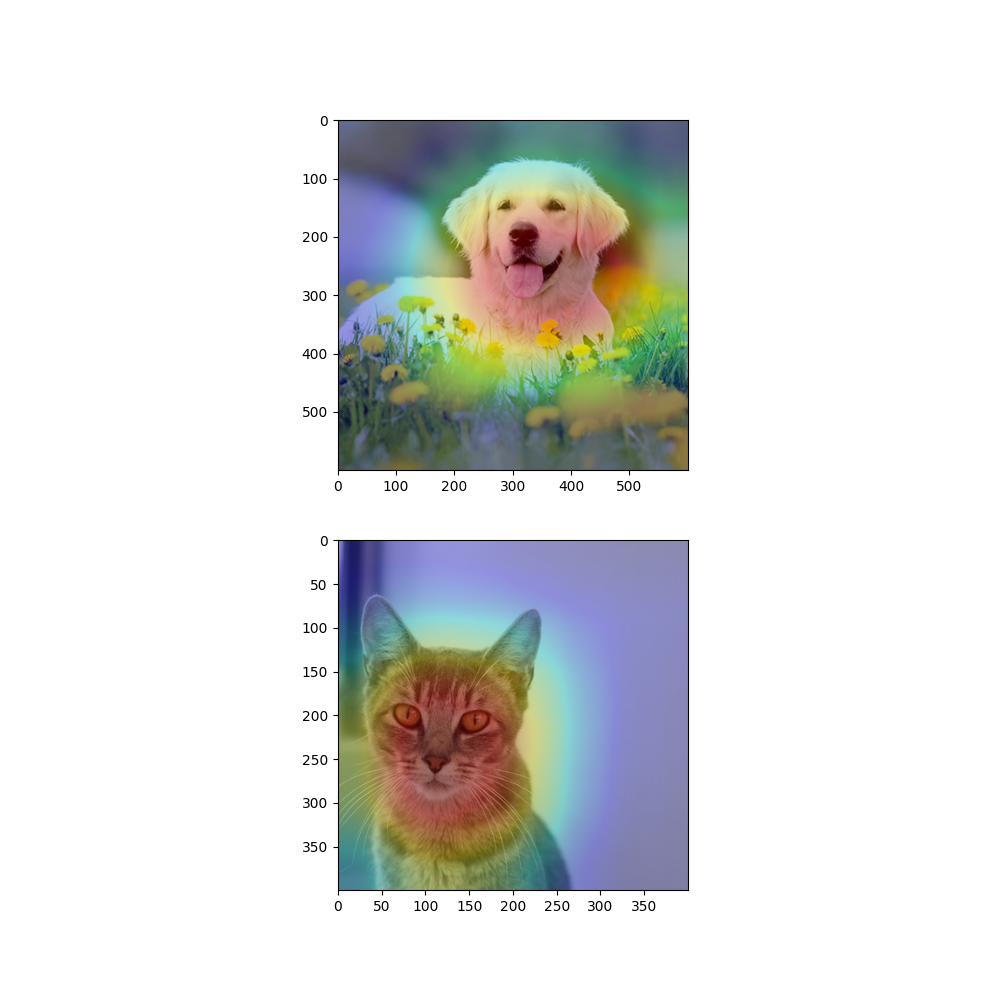

# Model-agnostic Class Activation Map Generator

This repository contains a model-agnostic module for generating Class Activation Maps (CAMs) in Pytorch. 

Our implemented CAM module can be used with any pretrained networks, given the name of the target layer before global average pooling. The demo provided below serves as a working example. 


# Demo

We have trained a ResNet-34 on STL-10 [dataset](https://cs.stanford.edu/~acoates/stl10/). Please download the pretrained weights using this [link](https://drive.google.com/file/d/1aXq1q5WDLgHcpFw06GzABfG7lO_BCHSY/view?usp=sharing). 

You can pass the following arguments:

```
parser.add_argument('--target_layer', default='layer4', type=str) # Name of the target layer (before the pooling layer)
parser.add_argument('--final_layer', default='fc', type=str) # Name of the last classification layer
parser.add_argument('--device', default='0', type=str) # Desired device id
```
Simply run the following for the demo: 

```
python main.py --target_layer=layer4 --final_layer=fc --device=0
```

The following represents the expected outputs using the provided sample test images: 




# Environment Setup

We have implemented the module in Pytorch (>1.6.0). You can install the requirments by running the following:

```
pip install -r requirments.txt
```

# Refrence

If you find this code useful, please consider citinng this repository:  

```
@misc{OpenSourceCode1,
  author = {Hatamizadeh, Ali},
  title = {Model-agnostic Class Activation Map Generator},
  year = {2020},
  publisher = {GitHub},
  journal = {GitHub repository},
  howpublished = {\url{https://github.com/ahatamiz/CAMs}}
}
```
